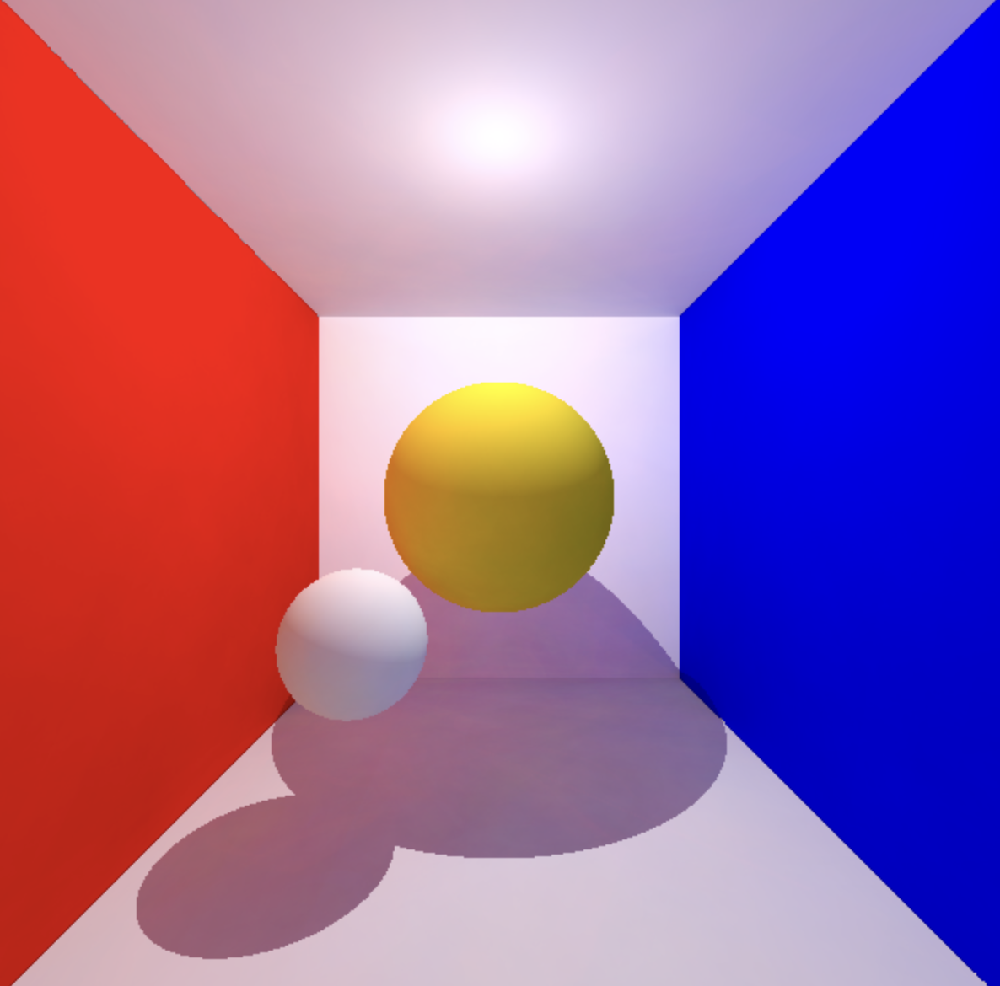

# Pathtracer

A progressive **path tracer** rendered entirely in the GPU with **WebGL2**, written in **TypeScript** and **GLSL**.

<p align="center">
  
</p>

## Features

- **Progressive rendering** — samples accumulate across frames via ping-pong `RGBA32F` framebuffers, converging over time
- **Area light with soft shadows** — a rectangular emitter sampled 4× per hit for penumbra
- **Physically-based materials**
  - **Diffuse** — hemisphere bounce sampling with cosine-weighted throughput
  - **Mirror** — perfect specular reflection
  - **Glass / dielectric** — refraction, total internal reflection, and Fresnel (Schlick) for a mix of reflection and transmission
- **Multi-bounce tracing** — up to 200 bounces with Russian-roulette path termination
- **Analytic geometry** — triangles (Möller–Trumbore intersection) and ellipsoids (quadratic solve)
- **GLSL-generated random texture** — a one-off noise texture seeds every frame's sampling for stable, reproducible noise

## Tech stack

| Layer  | Choice                            |
| ------ | --------------------------------- |
| Render | WebGL2                            |
| Shader | GLSL ES 3.00 (`#version 300 es`)  |
| Logic  | TypeScript                        |
| Build  | Vite (`rolldown-vite`)            |
| Math   | `gl-matrix`                       |
| Deploy | GitHub Pages (via GitHub Actions) |

## Getting started

```bash
# install dependencies
pnpm install

# start the dev server
pnpm dev

# type-check and build for production
pnpm build

# preview the production build
pnpm preview
```

Open the printed `localhost` URL. A WebGL2-capable browser with floating-point color buffer support (`EXT_color_buffer_float`) is required.

## How it works

1. A **noise pass** fills an `RGBA8` texture with random values, seeded once per frame.
2. The **pathtrace pass** traces one path per pixel per frame — for each hit it adds direct illumination from the area light (with shadow rays), then bounces the ray according to the surface material.
3. The result is **mixed into an accumulation texture** with weight `1 / (frameCount + 1)`.
4. A final **display pass** tone-maps and draws the accumulated radiance to the canvas.

Scene geometry and materials are declared in `src/constants.ts` and uploaded to the pathtracer as flattened uniform arrays.

## Project structure

```
.
├── index.html                 # Canvas + page entry
├── result.png                 # Rendered output
└── src/
    ├── main.ts                # WebGL setup, render loop, framebuffers
    ├── constants.ts           # Scene definition (triangles, ellipsoids, light)
    ├── utils.ts               # Shader / program helpers
    └── shaders/
        ├── pathtrace.frag     # The pathtracer: tracing, materials, lighting
        ├── noiseGen.frag      # Random-texture generator
        ├── display.frag       # Final tone-map / display pass
        └── shaders.vert       # Fullscreen-triangle vertex shader
```

## Attributions

Model from "Lion Crushing a Serpent" (https://skfb.ly/68s9T) by Rigsters is licensed under Creative Commons Attribution (http://creativecommons.org/licenses/by/4.0/).
